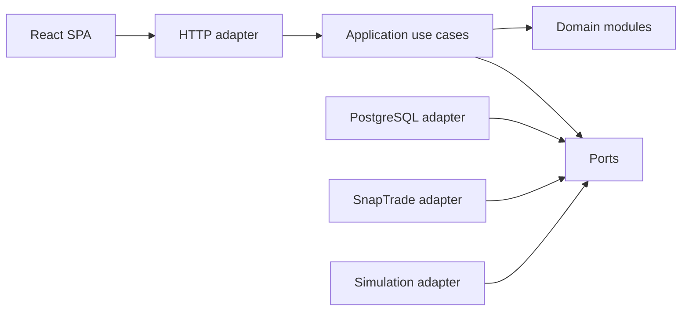
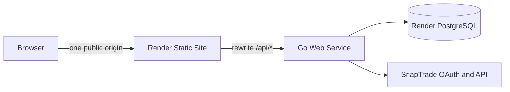

# Architecture Spine — Findur

This spine governs the publicly hosted assignment/evaluation build, not a production dating launch. It supports up to the SnapTrade Test OAuth app's five real users as independent authenticated viewers. Each viewer's SnapTrade data stays private; Discovery contains only generated synthetic candidates.

## Upstream Scope Reconciliation

- This architecture supersedes the PRD/UX assumption of one preconfigured owner. Any SnapTrade Personal subject admitted by the Test OAuth app may create an isolated Findur viewer account, up to SnapTrade's five-user test limit; there is no separate Findur password, public candidate signup, or app-side financial sharing between real users.
- This architecture supersedes PRD FR-28 and the corresponding UX notification/badging surfaces for the first cut. Because generated candidates can create interest or reciprocal outcomes only while an authenticated real user is active in Discovery, there is no meaningful offline event source. Browser push, notification preferences, installed-app badging, and a persistent notification feed are excluded from implementation stories.
- Incoming Interest may still be exercised as an in-session generated scenario. It is derived from the directed synthetic swipe state and presented within Discovery, not delivered through a notification subsystem.
- Every first-cut PRD/UX “Photo” is an application-provided placeholder avatar. Users choose no uploaded or remote image, and Mutual Match reveals that bundled placeholder.
- The first-cut acceptance interpretation of `diversified` is broader SnapTrade instrument-kind coverage followed by lower position concentration; `complementary` is lower asset-kind allocation overlap. Issuer distribution and claimed “balancing exposures” are excluded because the allowlisted SnapTrade projection does not supply a defensible issuer/sector model.

## Design Paradigm

Findur is a Go modular monolith with ports and adapters. Product modules own use cases and rules; adapters own HTTP, PostgreSQL, SnapTrade, time, and randomness. The React SPA consumes only Findur's OpenAPI contract and never calls SnapTrade directly.



Dependencies point inward. Domain and application packages cannot import HTTP handlers, generated transport types, PostgreSQL implementations, the SnapTrade SDK, or Render-specific code.

## Invariants & Rules

### AD-1 — One deployable backend [ADOPTED]

- **Binds:** all backend capabilities
- **Prevents:** premature services, queues, command buses, event sourcing, or separate read/write stores
- **Rule:** Implement one Go process as a modular monolith. Use resource-oriented use cases and atomic bulk updates. Add an asynchronous action resource only when work truly outlives a request. CQRS is not part of the first cut.

### AD-2 — Static frontend and API present one browser origin [ADOPTED]

- **Binds:** deployment, routing, authentication, sessions, CI/CD
- **Prevents:** cross-site cookie fragility, permissive CORS, and duplicated asset serving
- **Rule:** Deploy Vite output as a free Render Static Site and Go as a Render Web Service. Rewrite `/api/*` to Go before the final `/* -> /index.html` SPA rewrite. Register the public `/api/auth/snaptrade/callback` URL with SnapTrade. Render proxies browser API traffic under the Static Site's public origin.
- **Rule:** Story 0 must prove this topology on deployed Render with `GET`, an unsafe JSON request, callback query strings, multiple `Set-Cookie` headers, subsequent host-only cookie replay, `Cache-Control`, and error responses. If any authentication-critical behavior is not preserved, use the fixed fallback: build Vite in CI and serve its immutable assets plus SPA fallback from the Go Web Service so browser and API still share one origin; do not switch to permissive credentialed CORS by improvisation.
- **Rule:** Define both services, PostgreSQL, rewrites, health check, non-secret config, and `autoDeployTrigger: checksPass` in root `render.yaml`. Secrets use `sync: false` and live only in Render.
- **Rule:** Develop on free services, then move Go to the approximately $7/month instance for the evaluation window. Create a fresh free Render PostgreSQL database for the intended 30-day window.



### AD-3 — SnapTrade hosts login; Findur owns OAuth state and its session [ADOPTED]

- **Binds:** authentication, authorization, sessions, disconnect
- **Prevents:** collecting SnapTrade credentials, confusing OAuth Apps with Commercial user registration, and exposing provider tokens to the browser
- **Rule:** Redirect to SnapTrade's hosted OAuth/OIDC authorization and consent UI. Use authorization code with PKCE `S256`, fresh high-entropy `state`, `code_verifier`, and `nonce`. Store an expiring server-side authorization attempt, bind it to a separate one-time secure browser cookie and an allowlisted post-login route, and atomically consume it on the first callback. This cookie is only a pre-login correlation secret, not a Findur session. Reject missing/mismatched state or binding, expired or reused attempts, provider errors, and unregistered redirect destinations before exchanging a code.
- **Rule:** Request `openid read` initially; SnapTrade requires `read`. Add `email`, `profile`, `trade`, or `webhook` only through an explicit requirement change. A test user must have a SnapTrade Personal account with an existing brokerage connection; use the Sandbox brokerage for the evaluation path.
- **Rule:** A verified new SnapTrade `sub` may create one isolated OAuth-origin Findur user while the Test OAuth app admits it; an existing `(provider, sub)` resumes the same user. Do not add a separate username/password gate or assume one hard-coded owner.
- **Rule:** Bootstrap from `https://api.snaptrade.com/.well-known/openid-configuration` rather than hard-coding authorization, token, revocation, or JWKS endpoints. Use `golang.org/x/oauth2` and `github.com/coreos/go-oidc/v3/oidc`; cache metadata and JWKS in process and refetch keys when an unfamiliar `kid` appears. A discovery outage blocks new OAuth work but does not invalidate existing Findur sessions or cached portfolio snapshots.
- **Rule:** The deployed redirect URI is HTTPS and must match a registered URI exactly, including path and trailing slash. Local development may use only SnapTrade-supported HTTP loopback hosts. Authenticate this confidential client to token and revocation endpoints with HTTP Basic and form-encoded bodies; the client secret remains server-side.
- **Rule:** Validate the ID token's RS256 signature, issuer, audience, expiry, issued-at plausibility, and nonce. Persist stable `sub`; discard the ID token after callback. SnapTrade has no `userinfo` endpoint, so do not attempt one. If email is later requested, trust it for account linking only when `email_verified` is true.
- **Rule:** Do not use `AuthenticationApi.LoginSnapTradeUser`; it is the separate Commercial `userId`/`userSecret` Connection Portal flow. The SDK's client-credentials helper is also not the authorization-code login flow.
- **Rule:** Treat callback processing as a durable state machine: `pending -> exchanging -> succeeded|restart-required`. Claim the single-use attempt in a short transaction, exchange the code outside every transaction, then atomically bind `(provider, sub)`, persist the encrypted authorization, create the session, and record the terminal result. A replay never exchanges the code again: an already authenticated browser follows the recorded safe redirect; otherwise it starts fresh authorization. If token issuance may have succeeded but local finalization fails, immediately discard plaintext, make one bounded best-effort revocation outside a transaction when a token is known, record `restart-required`, and never retry the code.
- **Rule:** After callback, expire the attempt cookie and issue a cryptographically random opaque Findur session cookie: `Secure`, `HttpOnly`, host-only, and `SameSite=Lax`. Store only a keyed hash of the session ID in PostgreSQL. Support multiple sessions, one-session logout, logout-all, bounded idle/absolute expiry, and do not add Redis or application JWTs.
- **Rule:** For every unsafe session-authenticated method, require a random session-bound synchronizer token in `X-CSRF-Token`, validate a same-origin `Origin` (falling back to `Referer` only when necessary), and reject cross-site Fetch Metadata. `SameSite=Lax` is defense in depth, not the sole control. Safe methods and the provider OAuth callback are the only exemptions. Rotate the CSRF token with the session and declare the required header in OpenAPI.

### AD-4 — Provider tokens are encrypted, versioned, and refreshed through a lease [ADOPTED]

- **Binds:** OAuth token storage and refresh
- **Prevents:** plaintext database tokens, token swapping, concurrent use of a rotating refresh token, and unrecoverable key replacement
- **Rule:** Encrypt access and refresh tokens independently with AES-256-GCM from Go's standard library. Generate a fresh random nonce for every encryption. Authenticate associated data containing record owner, provider, token kind, and envelope version. Store `key_id`, nonce, ciphertext, access expiry, scopes, and row version; never store or log plaintext tokens, codes, ID tokens, or client secrets.
- **Rule:** Supply a versioned encryption key ring through Render secrets. One key is current for writes; older keys remain decrypt-only. Re-encrypt lazily after successful reads/refreshes or with bounded maintenance. Remove an old key only after no rows reference it. No key or example secret enters Git.
- **Rule:** Serialize refresh without holding a database transaction across the token request. A short transaction conditionally claims a per-authorization operation lease of kind `refresh` with a random lease ID, expected authorization lifecycle generation, row version, and deadline, then commits. The winner decrypts the claimed refresh token and calls the token endpoint outside every transaction. A second short compare-and-swap transaction atomically installs the rotated access/refresh envelopes, expiry, scopes, and version only when that lease and lifecycle generation remain current. Concurrent callers reuse a still-valid access token or wait/retry against authorization state within a strict bound; they never issue the same refresh independently.
- **Rule:** A timeout or transport outcome that could have reached the token endpoint is ambiguous because rotation may already have consumed the refresh token. Do not replay it automatically. Retry a discovery failure known to precede the token exchange with bounded backoff, then release its guarded lease and return a temporary failure if discovery remains unavailable. If provider success cannot be committed, or the lease expires without a safely classifiable pre-send failure, transition to reauthorization-required with a guarded short transaction. A caller whose contention wait expires reports a temporary wait failure while another lease remains active.
- **Rule:** Every server-side SnapTrade portfolio read obtains its bearer through one per-user credential source. Treat an access token as refresh-due 15 minutes before its recorded expiry. On API `401`, the shared read boundary refreshes once and retries the same safe request once; concurrent callers reuse the one installed replacement token. A second `401` disables usable authorization and requires authorization again.
- **Rule:** While an authorization is `reauthorization-required`, the account sync worker does not claim further resources for that user. A fresh OAuth grant restores claim eligibility; temporary provider failures continue through bounded per-resource backoff. Emit categorical structured events for lease claims, contention, successful rotation, `401` recovery, and authorization failure without credentials or financial payloads.
- **Rule:** Record the token response's granted scope and approximately ten-hour access-token lifetime rather than assuming the requested scope was granted. Refresh tokens have no fixed time expiry but rotate on successful use. A refresh response does not contain an ID token and must not alter the Findur identity established by the verified authorization-code response.
- **Rule:** Disconnect intent wins over refresh. Its prepare transaction marks the authorization `disconnecting`, increments the authorization/portfolio lifecycle generation, and blocks new provider and refresh claims. If a refresh is already in flight, disconnect waits only to its lease deadline. A refresh result that loses its install guard makes one bounded best-effort revocation of the newly returned refresh token before discarding it. Disconnect then claims the mutually exclusive operation lease, revokes the newest known refresh token outside every transaction using the discovered endpoint and `token_type_hint=refresh_token`, and finally removes local credentials and authorized portfolio state even if revocation fails. An ambiguous provider outcome is recorded safely and directs the user to revoke the connection in the SnapTrade dashboard; reconnection always starts a fresh authorization flow.

The Render secret plus encrypted columns protects against a database-only disclosure. It does not protect against full compromise of the running service, which can access both key and ciphertext. Production would require managed key custody and an operational rotation process.

### AD-5 — Keep SnapTrade behind one generated, request-shape-proven adapter [ADOPTED]

- **Binds:** all SnapTrade data access
- **Prevents:** provider types leaking inward, a handwritten provider client, a broad SDK fork, and unverified assumptions about outbound authentication
- **Rule:** First use the current official `github.com/passiv/snaptrade-sdks/sdks/go` release, which SnapTrade lists for this integration path, behind a Findur-owned `PortfolioProvider` port. Supply each user's bearer access token only on the server and immediately map responses into purpose-limited internal values.
- **Rule:** Cover every allowlisted OAuth operation with a normal request-shape integration test that asserts `Authorization: Bearer` and the OAuth-page requirements. This verifies our SDK configuration and guards upgrades; it is not a competing-client evaluation.
- **Rule:** Story 0 cannot pass until the current official SDK release/configuration proves the required bearer-only request shape—no Commercial `clientId`, `consumerKey`, `userId`, `userSecret`, `timestamp`, or `Signature`—against WireMock. Published v1.1.0 is known to require and emit `userId`/`userSecret` on relevant generated calls, so it is not accepted by assumption; first verify whether SnapTrade supplies a corrected release or supported configuration.
- **Rule:** If that official path still fails, use the pre-authorized fallback: pin SnapTrade's upstream OpenAPI document by source revision, apply one small checked-in overlay that makes the Commercial-only fields absent for only the allowlisted bearer operations, and generate the narrow adapter client reproducibly. CI must show the upstream-versus-overlay diff, regenerate without drift, and run the same WireMock request-shape fixtures. Do not hand-edit generated output, expand the overlay beyond demonstrated incompatibilities, or maintain a general SDK fork.
- **Rule:** The composition root creates one purpose-limited SnapTrade adapter instance and injects it into inventory bootstrap and the worker-owned initial/scheduled synchronization path. Account-selection saves perform no provider calls. Every outbound data request shares one process-level admission gate, circuit state, HTTP implementation, response-size policy, and categorical error mapper. Do not construct feature-local provider clients that bypass those controls.

### AD-6 — Retrieve only provider data the experience uses [ADOPTED]

- **Binds:** Portfolio Showcase, Account Inclusion, signals, refresh
- **Prevents:** collecting every financial field, deprecated endpoints, and manufactured performance
- **Rule:** Initially allowlist connections/authorizations, accounts, per-account balances, all account positions, and offset zero of the newest 50 activities. Do not paginate activities beyond that page. Before Account Inclusion confirmation, retrieve and retain only connection/account inventory fields needed to show the masked selection list; do not request balances, positions, or activities and discard unused account-list fields during mapping. Do not call trading, tax-lot, symbol/reference, manual-refresh, or webhook operations.
- **Rule:** Bootstrap account inventory once per owner. A returning OAuth login rotates credentials and fences in-flight portfolio work but preserves the published inventory head and versions; it does not call the provider inventory endpoints again. Explicit retry/reconnect is the only inventory refresh path.
- **Rule:** Exclude orders and return-rate/performance endpoints initially. Activities satisfy recent evidence. Performance stays unavailable unless period, coverage, currencies, inputs, and freshness can be defended.
- **Rule:** Keep accounts, balances, positions, activities, connection state, and freshness as separate datasets. Never silently aggregate currencies.
- **Rule:** Obtain current connection/account lifecycle state by listing connections and then accounts per connection. Do not use the global always-Daily account listing as the freshness authority.

### AD-7 — Normalize and atomically publish snapshots; retain no raw payloads [ADOPTED]

- **Binds:** ingestion, persistence, disclosure, matching
- **Prevents:** raw financial payload accumulation, partial snapshots, and one misleading global freshness time
- **Rule:** Provider responses exist only transiently in memory. Normalize only fields needed by Account Inclusion, owner display, approved disclosure, or matching. Never persist or log complete SnapTrade bodies.
- **Rule:** Perform provider calls outside the publish transaction. Publish connection/account inventory at portfolio scope and balances, positions, and activities as immutable per-account dataset versions. Atomically move the matching scoped head and retain the last trustworthy version on failure. Each account/dataset carries its own provider observation, retrieval, and freshness metadata; there is no single portfolio-wide freshness timestamp.
- **Rule:** Every inventory, account, signal, and Account Inclusion addition call captures the authorization/portfolio lifecycle generation, effective inclusion version, and required account membership before leaving the database. Its finalize transaction must prove the grant is still active, the captured generations remain current, and every account is still included—or is still pending in that same current inclusion change for an addition. Removal and disconnect advance the lifecycle generation before suppressing or deleting state. A stale finalizer discards its transient response and may not recreate credentials, versions, heads, signals, or anchors.
- **Rule:** Balance and position refreshes publish replacement snapshots. Activities are an intentional bounded-history exception: upsert normalized rows by stable provider activity ID, retain accumulated unique rows, and project only the newest 50 by trade date with a deterministic ID tie-breaker. The accepted limitation is that more than 50 new activities between daily reads can leave older unseen rows undiscovered. Generated users use the same versioned snapshot structure as OAuth users.
- **Rule:** Account Inclusion saves membership immediately in a short transaction and makes no provider calls. A first-time account is visible at once with unavailable datasets and explicit syncing feedback while the worker prepares balances, positions, and activities; the feedback clears only after every newly selected account completes all three resources. Removal immediately suppresses affected views/use and invalidates anchors/signals by deleting membership only; retain its normalized datasets and first-sync history. Re-inclusion restores membership without provider calls regardless of retained-data age, and the scheduler later refreshes it when due. Disconnect or user deletion remains the hard-purge boundary through owner-scoped cascades.
- **Rule:** A privacy-decreasing Disclosure Level save commits the narrower policy and invalidates higher-detail anchors/projections in the same short transaction. Higher-tier server/client caches and rendered state are then purged fail-closed; a retry must never restore the old level. A disclosure increase becomes visible only after its save commits.

### AD-8 — Refresh is scheduled, leased, bounded, and stale-while-revalidate [ADOPTED]

- **Binds:** provider calls, rate limiting, resilience, freshness UI
- **Prevents:** calls on every view, hidden billable refreshes, refresh storms, and blank UI during transient failures
- **Rule:** Each process runs one cancellation-aware worker immediately and once per minute, but a singleton expiring PostgreSQL pass lease permits only one process to drain globally. A process executes passes synchronously, never overlaps them, and coalesces missed ticks instead of queuing catch-up work. It refreshes only currently included and currently selectable accounts with a missing dataset head or a complete bundle at least 24 hours old, plus unfinished first synchronization. Excluded accounts are never routinely refreshed. Serve the last trustworthy freshness-labelled snapshot while bounded refresh runs.
- **Rule:** Portfolio reads return selected account identities before their initial datasets exist. While an inclusion change is pending, clients label unavailable datasets as syncing, periodically re-read Findur's APIs, and never trigger provider work themselves.
- **Rule:** Process one account at a time, serialize all SnapTrade adapter requests at least one second apart, and stop admitting work after 45 seconds per pass. A backlog drains across later ticks. Never trigger billable manual refresh automatically.
- **Rule:** A short PostgreSQL transaction claims one due account resource with `FOR UPDATE SKIP LOCKED`, a random claim ID, captured inclusion/inventory/lifecycle generations, and a one-minute lease. Commit before any provider request. The finalize transaction publishes and checkpoints that resource only when the exact live claim, membership, current selectability, and every captured generation still match. Later claims skip resources already checkpointed in the current cycle, so a partial failure retries only the incomplete provider call. The account completion time advances after all three resources advance. A stale or late result is discarded; an expired lease makes crashed work recoverable across processes.
- **Rule:** Keep throttling and circuit decisions explicit within the shared adapter. A valid HTTP `429 Retry-After` value (delta seconds or HTTP date) opens the circuit until that time, with a conservative fallback when missing. Repeated transport/timeouts/`5xx` open a shorter circuit; `401` and ordinary `4xx` do not. A scheduled failure retains last-good heads and membership, releases the claim, and records bounded exponential retries at 1, 2, 4, 8, 16, then 32 minutes.
- **Rule:** Emit structured pass/claim/outcome/latency logs using claim IDs and short one-way account references only; never log credentials, account labels, provider payloads, or financial values. On shutdown, fail readiness and stop admission, drain HTTP, allow in-flight guarded finalization within the shared shutdown deadline, wait for the worker, then close PostgreSQL.
- **Rule:** Evaluate freshness per account and dataset from provider observation/sync metadata, not request time alone. For holdings datasets, `current` means at most 15 minutes old in real-time mode or 36 hours in Daily mode; older data is `stale-usable` through 72 hours and unusable afterward. Activities are current when their provider transaction-through date is within two calendar days, stale-usable through seven days, and unusable afterward. Missing initial data, revoked grants, or disabled connections are immediately unusable regardless of age. These first-cut constants are centralized and acceptance-tested.
- **Rule:** A disabled brokerage connection is not an expired OAuth grant. Keep the Findur session, label cached data stale/unavailable, and direct the owner to repair the connection in the SnapTrade Personal Dashboard; use reauthorization only for grant/token failure.

### AD-9 — Synthetic candidates use the same domain without provider credentials [ADOPTED]

- **Binds:** synthetic population, Discovery, disclosure, matching
- **Prevents:** source-specific candidate rules, per-viewer copies, and provider access for generated users
- **Rule:** Keep one shared generated population using the same profile, normalized portfolio, disclosure, candidate, swipe, and match schemas. Record immutable origin as `oauth` or `generated`; never infer it from a token. Generated users have no OAuth identity, token, or login session.
- **Rule:** Real users never appear in another real user's Discovery. Every real viewer receives only generated candidates. Eligibility and disclosure rules apply identically regardless of origin; provenance changes labeling, authentication, refresh, and lifecycle only.
- **Rule:** Synthetic reciprocal swipes are deterministic simulations. Real-user swipes and resulting matches remain viewer-specific.
- **Rule:** Seed the initial shared population through an idempotent generator command with explicit algorithm version, seed, and population size. Derive stable generated IDs and scenario tags from those inputs, validate the required disclosure/proximity/freshness/portfolio/match boundary matrix before activation, and never read OAuth-origin rows or external exports as generator input.

### AD-10 — Synthetic state advances in one coherent singleton tick [ADOPTED]

- **Binds:** generated presence and portfolio evolution
- **Prevents:** per-request flicker, contradictory fields, duplicate multi-instance updates, and replay storms after Render sleep
- **Rule:** Every Go instance may run a context-aware ticker, but only the instance acquiring a fixed PostgreSQL `pg_try_advisory_xact_lock` advances the durable schedule. Use `pgx/v5` directly; a distributed scheduler package adds needless lease/job-system machinery for this one short database task.
- **Rule:** One bounded deterministic batch rotates users online/offline and applies coherent price/value, deposit, withdrawal, trade, or rebalance events. Preserve invariants across balances, quantities, prices, values, allocations, currencies, and activities. Publish atomically and retain a minimum online inventory.
- **Rule:** Coalesce missed intervals after restart instead of replaying each tick. Inject clock and seed for reproducible tests.

### AD-11 — Discovery recalculates instead of persisting a full deck [ADOPTED]

- **Binds:** candidate selection, Candidate Detail, navigation
- **Prevents:** stale deck order and an active card changing beneath the viewer
- **Rule:** Do not persist full deck runs. Each next-card request applies current eligibility, preferences, portfolio signals, presence, disclosure compatibility, prior impressions/swipes, and safety rules, then orders candidates with the adopted deterministic comparison and tie-breakers.
- **Rule:** Persist swipes and matches plus a lightweight current-candidate/navigation anchor. Briefly lease the active card and pin its snapshot/version so Detail and Back restore safely. Calculate the next candidate from current state after decision or invalidation.
- **Rule:** A nondisruptive background refresh does not replace an active anchor. Treat eligibility changes, visible disclosure changes, source-coverage/freshness boundary changes, or a displayed signal-band change as material: retain the last safe pinned view until the user acknowledges the update, then recalculate. A permission decrease or newly ineligible candidate invalidates the anchor immediately and reveals no prior sensitive content.

### AD-12 — OpenAPI is the authored Findur API contract [ADOPTED]

- **Binds:** browser/backend contract, validation, generation, tests
- **Prevents:** duplicate Go/TypeScript models, parallel JSON Schema, and unnecessary JSON:API ceremony
- **Rule:** Author one OpenAPI 3.1 document using ordinary JSON resources. With pinned `github.com/oapi-codegen/oapi-codegen/v2` v2.8.0, generate Go models, the standard-library `net/http` server glue, and `StrictServerInterface`. Use pinned `github.com/oapi-codegen/nethttp-middleware` v1.2.0 for request validation against the same spec. Generated files are never hand-edited.
- **Rule:** A handwritten HTTP adapter implements the generated strict interface and delegates every product operation to an application service/use case. It maps generated transport DTOs to application inputs and maps typed service results back to generated response objects. Generated DTOs never become domain entities; handlers never call repositories or provider adapters directly. Transport-only health/readiness handlers are the only exception.
- **Rule:** Generate browser types with pinned `openapi-typescript` 7.13.0 and use one small Findur-owned `fetch` adapter typed from those operations. Do not adopt maintenance-mode `openapi-fetch` or hand-maintain parallel request/response interfaces. CI regenerates Go and TypeScript artifacts and fails on any diff.
- **Rule:** Use resource endpoints and atomic bulk saves. Protect overwritable resources with versions or ETags. Add separate JSON Schema only if a later non-HTTP interchange format needs it.
- **Rule:** Define separate owner-private, pre-match candidate, post-match candidate, and preview response schemas. The server performs disclosure projection before serialization; it never sends higher-tier fields or a candidate `avatar_key` to the browser and relies on CSS to hide them. Protected API responses use `Cache-Control: private, no-store`.

### AD-13 — PostgreSQL is shared state and coordination [ADOPTED]

- **Binds:** persistence, sessions, simulation, migrations
- **Prevents:** Redis/sticky sessions, positional SQL drift, and concurrent migrations
- **Rule:** Use native `github.com/jackc/pgx/v5` with `pgxpool`. Authored parameterized repository SQL uses descriptive `@name` placeholders with `pgx.StrictNamedArgs` or strict struct args; do not author `$1`, `$2`. Parameterless DDL, migrations, and generated SQL are exempt. Do not add `sqlx` solely for named parameters.
- **Rule:** Use `github.com/golang-migrate/migrate/v4` with versioned up/down SQL and its PostgreSQL driver's migration lock; do not layer a second outer advisory lock. Run the migration binary at free-tier startup and through Render `preDeployCommand` when supported. Follow expand/contract changes.

### AD-14 — CI proves contracts and integration before deployment [ADOPTED]

- **Binds:** delivery and tests
- **Prevents:** environment-only failures, stale generated clients, and deploy-before-test races
- **Rule:** GitHub Actions is authoritative. Checks cover OpenAPI and generation drift, Go format/vet/test, frontend lint/type/test/build, migrations against PostgreSQL, and provider integration against WireMock. Render deploys only after checks pass.
- **Rule:** Drive WireMock from allowlisted SnapTrade shapes and curated fixtures, plus authored OAuth/token/rate-limit/failure cases. Assert request method/path, bearer header, absence of Commercial auth fields, decoding, normalization, and error classification. Pact is not required.
- **Rule:** CI uses no live SnapTrade credentials. Personal test accounts with the Sandbox brokerage are for manual smoke testing only.

### AD-15 — Use Render-native observability and safe structured logs [ADOPTED]

- **Binds:** runtime operations
- **Prevents:** leaking financial data/tokens and unnecessary Datadog/OpenTelemetry infrastructure
- **Rule:** Emit JSON with `log/slog` to stdout/stderr and use Render logs, metrics, deploy events, and health checks. Log opaque IDs, categorical outcomes, dataset, latency, status class, freshness transition, and safe SnapTrade request IDs. Never log tokens, codes, secrets, raw payloads, exact financial values, or unredacted personal data.

### AD-16 — Accessibility is a component-system constraint [ADOPTED]

- **Binds:** all browser UI
- **Prevents:** inaccessible custom primitives and divergent card behavior
- **Rule:** Use React Aria Components as the accessibility-first component foundation. Preserve keyboard, focus, reduced-motion, zoom/reflow, semantic labels, and equivalent text for visualizations. Candidate Card and Profile Preview share disclosure and visualization components.
- **Rule:** The first cut has no profile-image upload or remote image URL. Profiles select an allowlisted placeholder-avatar key whose assets ship with the frontend; synthetic profiles use the same set. Treat the avatar as decorative when the adjacent profile name already conveys identity. Do not create media storage, processing, or upload endpoints.

### AD-17 — Synthetic outcomes stay in the active Discovery flow [ADOPTED]

- **Binds:** incoming-interest and mutual-match presentation
- **Prevents:** building Web Push, subscriptions, notification outboxes, badging, or background delivery for events that cannot originate while the user is absent
- **Rule:** The first cut has no browser notifications or app-icon badging. Real users interact only with generated candidates, and synthetic reciprocal outcomes are resolved while the real user is actively using Discovery. Present the resulting interest or Mutual Match immediately in the authenticated in-app flow.
- **Rule:** Persist directed real and generated swipes and any resulting match atomically so a refresh can restore the result safely. Incoming Interest is a generated-to-real positive swipe presented once within active Discovery. Do not create a general notification or activity-feed subsystem; chat and match history also remain out of scope.

### AD-18 — Proximity uses selected coarse areas [ADOPTED]

- **Binds:** profile location, maximum-distance eligibility, candidate ordering, proximity display
- **Prevents:** collecting precise location, adding a geocoding provider, requiring PostGIS, or exposing coordinates/exact distances
- **Rule:** Provide a fixed, seeded catalogue of coarse city/region areas. OAuth and generated profiles reference one area identifier; do not request browser/device location, infer location from IP, or accept an address/postal code.
- **Rule:** Keep each area's public centroid in server-owned reference data and calculate great-circle distance with a tested Haversine domain function. The small evaluation population does not justify a PostgreSQL spatial extension. Treat `distance <= maximum_distance` as eligible and use the same calculated value for deterministic nearer-first influence.
- **Rule:** The API may return the permitted coarse area label and a configured distance band, but never centroid coordinates or exact calculated distance. Label proximity as approximate because centroid distance is not person-level distance. Changing the viewer's area or maximum distance invalidates the current candidate anchor and recalculates future selection.

### AD-19 — Matching is a small projection of documented SnapTrade data [ADOPTED]

- **Binds:** provider retrieval, normalization, derived signals, and deck ordering
- **Prevents:** a generic recommendation engine, invented provider fields, external market/FX enrichment, ML, and work that does not prove the SnapTrade-backed product concept
- **Rule:** Keep the first-cut provider projection allowlisted:

  | SnapTrade operation | Fields Findur uses |
  | --- | --- |
  | accounts | stable account/connection identity, category, masked display metadata, account total with currency, sync/freshness state |
  | `/accounts/{accountId}/positions/all` | instrument identity and kind, units, price, cost basis only where displayed, currency, cash-equivalent flag, response freshness |
  | `/accounts/{accountId}/balances` | currency, cash, and buying power only where displayed |
  | bounded recent `/accounts/{accountId}/activities` page | activity identity, normalized type, trade/recorded date, and amount/instrument fields only where the selected disclosure view requires them |

- **Rule:** Derive only an asset-kind allocation vector, asset-kind breadth, and largest-position concentration from supported positions for first-cut compatibility. `similar` orders by the smallest allocation difference, `diversified` by broader asset-kind coverage then lower concentration, and `complementary` by lower allocation overlap. After hard eligibility, approximate proximity is the secondary ordering input and a stable candidate ID is the final tie-breaker. Do not expose an internal score.
- **Rule:** Cash and activity recency may produce coarse display bands but do not affect first-cut ranking. Do not fetch orders, returns, tax lots, quotes, fundamentals, sectors, or external enrichment for matching.
- **Rule:** Snapshot presentation may render supported same-currency cash as a separate composition segment alongside position allocation. Cash is not inserted into the compatibility asset-kind vector.
- **Rule:** Compute position value only when units, price, and currency are present. Within an included account, compare positions only in the account total's currency; omit unsupported currency rows from the derived mix and report reduced coverage rather than converting or inventing a value. Combine account-level normalized vectors with equal account weight, avoiding implicit cross-currency aggregation.
- **Rule:** The same versioned signal builder consumes normalized OAuth and generated snapshots. Missing or stale provider fields remain unknown and reduce coverage; they never become zero or synthetic substitutes in the owner's live profile.

### AD-20 — Application use cases own explicit transaction scopes [ADOPTED]

- **Binds:** every database mutation spanning repositories, including OAuth callback/finalization, Account Inclusion, snapshot publication, profile/disclosure saves, simulation ticks, swipes, and matches
- **Prevents:** partial local commits, repositories silently opening nested transactions, transaction loss across service calls, and slow external I/O consuming locks or transaction time
- **Rule:** Define one application-facing `UnitOfWork`/transactor port. A use case opens the transaction and receives a transaction-scoped repository set in its callback; it passes those repositories explicitly to nested application operations. Repositories accept the provided `pgx.Tx`-bound executor and never begin, commit, or roll back independently. Domain code knows neither `pgx` nor transactions.
- **Rule:** Context carries cancellation, deadlines, and request metadata—not a hidden transaction. `Begin`, callback error/panic rollback, commit, and retry classification live in the PostgreSQL adapter. Nested application work joins the caller's explicit repository scope; only the outer use case controls completion.
- **Rule:** Session middleware derives an immutable authenticated `Actor` from the verified server-side session and passes it explicitly to every owner-scoped application input; client paths/bodies never supply or override the acting `user_id`. Services authorize subordinate resources against that actor, and repositories scope owner-private reads and writes by both actor owner and resource identity. Generated candidate reads are the deliberate exception and still pass through eligibility/disclosure projection. Integration tests attempt every owner-private read and mutation, including disconnect and Account Inclusion, with another user's opaque IDs.
- **Rule:** No network, provider, OAuth/OIDC, filesystem, sleep, or other unbounded external operation runs inside a database transaction. Use prepare/call/finalize: read or claim minimum state in a short transaction, commit, perform external work, then publish with a short version-checked transaction. Transaction callbacks contain only bounded computation and PostgreSQL operations.
- **Rule:** Keep transaction retries rare and explicit: retry only a whole idempotent use case for recognized serialization/deadlock failures, with a strict attempt limit and jitter. Never retry after an external side effect unless its protocol and local idempotency key make the outcome safe.

### AD-21 — The installable web shell never caches protected data [ADOPTED]

- **Binds:** localization, theme, web-app installation, browser caches, logout, and permission decreases
- **Prevents:** sensitive offline/task-switcher remnants, divergent locale/theme ownership, and a service worker silently retaining authenticated responses
- **Rule:** Ship a generic Web App Manifest and non-sensitive bundled icons, but no service worker or offline authenticated experience in the first cut. Hashed public static assets may be cached immutably; authenticated HTML/API responses are `private, no-store` and never enter Cache Storage.
- **Rule:** Keep English/French message catalogues in the frontend and format dates, numbers, percentages, distances, and currencies with `Intl`. Persist authenticated locale and `system|light|dark` theme on the profile; public/pre-login choices may use non-sensitive browser storage and are copied into the profile after login.
- **Rule:** On logout, session failure, disconnect, Account Inclusion removal, or disclosure downgrade, clear relevant in-memory query/navigation state before rendering the safe replacement route. Do not persist protected API payloads in local/session storage or IndexedDB. Use generic document titles/manifest metadata and acknowledge that browser/OS task-switcher snapshot suppression is best-effort, not a security guarantee.

### AD-22 — The Go process shuts down gracefully but remains crash-safe [ADOPTED]

- **Binds:** HTTP serving, readiness, background refresh, simulation, migrations, and PostgreSQL lifecycle
- **Prevents:** new work entering a terminating instance, truncated in-flight responses, background goroutine leaks, premature pool closure, and correctness that depends on receiving a shutdown signal
- **Rule:** `cmd/findur` owns one root context and worker group. On `SIGTERM` or `SIGINT`, atomically fail readiness, stop claiming background work, cancel background provider calls/tickers, and invoke `http.Server.Shutdown` with the centrally configured drain deadline. Keep PostgreSQL open while admitted HTTP work and workers drain; then close the pool and exit. If the deadline expires, cancel remaining work and return a non-zero exit rather than hanging.
- **Rule:** Liveness reports only process health; readiness becomes true only after configuration validation, required migrations, and dependency checks complete, and becomes false before draining. HTTP handlers and every provider/database operation propagate request or root cancellation and set stricter operation deadlines than the overall drain deadline.
- **Rule:** Graceful shutdown is an optimization, not a correctness boundary. Authorization operation leases, refresh claims, Account Inclusion changes, and simulation coordination have durable deadlines/idempotency guards so a hard kill or Render restart is recovered safely by another instance without manual cleanup.

## Consistency Conventions

| Concern | Convention |
| --- | --- |
| Go packages | Organize by product module; define ports near consumers and adapters at the edge. No generic `utils`, service locators, or provider types outside the SnapTrade adapter. |
| API | `/api` prefix, stable OpenAPI operation IDs, opaque IDs, UTC timestamps with offsets, and no direct database-row exposure. |
| Numeric values | PostgreSQL `numeric` and Go `shopspring/decimal`, registered through `pgx-shopspring-decimal`. Do not use universal integer cents: currencies, fractional units, prices, and crypto require differing scales. OpenAPI carries decimals as strings; monetary values pair amount with ISO-4217 currency. Preserve decimal-string SDK fields exactly. For fields the official SDK exposes only as `float32`, explicitly accept that upstream SDK precision limit, convert with `strconv.FormatFloat(float64(value), 'g', -1, 32)` before decimal parsing, record `sdk-float32` source precision, and test loss-revealing fixtures; never claim original JSON precision or persist binary-float artifacts. Never aggregate currencies without an explicit FX model. |
| Distance | Store maximum distance as integer kilometres and area centroids as validated `double precision` latitude/longitude in seeded server data. Calculate with one tested Haversine implementation; translate only presentation labels, never units by string concatenation. |
| SQL | Named `@parameter` placeholders with strict argument matching for authored parameterized queries. Repositories accept application/domain values, not HTTP DTOs. |
| Transactions | The application use case owns one explicit transaction per local invariant and propagates transaction-bound repositories. Repositories never begin nested transactions; all external work stays outside. |
| Errors | Consistently classify validation, authentication, authorization, version conflict, provider unavailable, rate limited, and internal failures without exposing raw provider bodies. |
| Configuration | Environment variables read at startup; fail closed on missing secrets. Public defaults may live in `render.yaml`; secrets and `.env` never enter Git. |
| Bounded policy | `internal/platform/config` is the sole typed owner of OAuth-attempt, session, provider-call, operation-lease, activity-window, snapshot-grace, anchor, transaction-retry, and shutdown-drain limits. Checked-in evaluation defaults and validation bounds are acceptance-tested; clients cannot override them, and changes to security, retention, or provider budgets require architecture review. |
| Tests | Inject clock, randomness, provider port, and transaction boundary. Use real PostgreSQL for persistence/locks/migrations and WireMock for provider HTTP. |

The checked-in evaluation defaults are deliberately small and may be changed only in that typed configuration owner: OAuth attempt 10 minutes; session idle 12 hours and absolute 7 days; provider call 10 seconds; authorization operation lease/wait 30 seconds; activities offset zero with a 50-row request and response ceiling; portfolio refresh age 24 hours; worker tick 1 minute and pass budget 45 seconds; unpinned old-snapshot grace 24 hours; candidate-anchor expiry 15 minutes; transaction retry maximum 3 attempts; and graceful drain 25 seconds. Consent withdrawal and disconnect override every retention grace immediately.

## Write Ownership and Cross-Module Transactions

| State | Sole write owner | Named coordinating use cases |
| --- | --- | --- |
| users, external identities, OAuth attempts/authorizations, sessions | `auth` | OAuth callback, disconnect |
| profiles, preferences, immutable disclosure versions/heads | `profile` | onboarding completion, disclosure save |
| connections, accounts, inclusion, datasets, signal sets/heads | `portfolio` | Account Inclusion save, provider refresh, disconnect cleanup |
| candidate anchors | `discovery` | next candidate, disclosure/inclusion invalidation |
| swipes and matches | `matching` | settle swipe / reciprocal outcome |
| generated schedule and generated-domain publication | `simulation` coordinator through owner-supplied transaction-scoped ports | simulation tick, initial generation |

Cross-module use cases coordinate transaction-scoped ports supplied by the owning module; they never issue SQL against another module's tables or call a service that opens a nested transaction. The common lock order is authorization/user lifecycle, portfolio/inclusion, dataset/signal heads, disclosure/anchors, then swipes/matches. Disconnect, disclosure save, Account Inclusion save, swipe settlement, and simulation publication follow this order and are covered by concurrency tests.

## Structural Seed

```text
cmd/findur/                 # process assembly and lifecycle
internal/
  auth/                     # OAuth attempts, sessions, token lifecycle
  portfolio/                # inclusion, snapshots, normalization, signals
  discovery/                # eligibility, ranking, current-card anchor
  matching/                 # swipes, synthetic reciprocity, matches
  profile/                  # profile, preferences, disclosure
  simulation/               # generated users, presence, portfolio events
  platform/
    postgres/               # pgx repositories and transactions
    snaptrade/              # SDK boundary and request-shape checks
    httpapi/                # generated strict bindings + handwritten service-delegating adapter
api/openapi.yaml            # authored Findur API contract
db/migrations/              # golang-migrate SQL
web/                        # React/Vite SPA
test/integration/           # PostgreSQL and WireMock suites
render.yaml                 # Render Blueprint
```

## Capability → Architecture Map

| Capability / Area | Lives in | Governed by |
| --- | --- | --- |
| SnapTrade login and session | `internal/auth` | AD-2, AD-3, AD-4 |
| Account Inclusion and Portfolio Showcase | `internal/portfolio` | AD-5 through AD-8 |
| Profile, preferences, disclosure, preview | `internal/profile`, shared web components | AD-12, AD-16, AD-18 |
| Synthetic population and lifecycle | `internal/simulation` | AD-9, AD-10 |
| Discovery and Candidate Detail | `internal/discovery` | AD-9, AD-11, AD-18, AD-19 |
| Swipes and Mutual Match | `internal/matching` | AD-9, AD-11 |
| API and browser contract | `api/openapi.yaml`, `internal/platform/httpapi`, `web` | AD-12 |
| Persistence and migrations | `internal/platform/postgres`, `db/migrations` | AD-13 |
| Provider tests and delivery | `test/integration`, `.github/workflows`, `render.yaml` | AD-5, AD-14 |
| Operations | process middleware and Render | AD-15 |
| Process lifecycle and graceful shutdown | `cmd/findur`, platform lifecycle | AD-22 |
| Public shell, legal/trust/contact surfaces | `web` | AD-12, AD-16, AD-21 |
| Onboarding and Discovery-readiness gates | `internal/auth`, `internal/profile`, `internal/portfolio` | AD-3, AD-7, AD-12, AD-20 |
| Locale, theme, and installability | `web`, `internal/profile` | AD-16, AD-21 |
| In-session outcomes; notifications excluded | `internal/matching`, `web` | AD-17, Upstream Scope Reconciliation |

## Deferred

- **Blocking SDK compatibility gate:** Pin the current official Go SDK in Story 0 and prove bearer-only OAuth request capture before any portfolio-data story starts. If no corrected official release/configuration exists, use AD-5's already-authorized pinned upstream-spec overlay and generated narrow client; no handwritten client or general SDK fork is authorized.
- **Version baseline:** Story 0 records all runtime/library versions in `go.mod`, lockfiles, tool manifests, WireMock image digest, and CI. Require Go 1.25 or newer for the adopted OpenAPI 3.1 toolchain and test the same supported current Go release Render supplies; Render's native Go runtime follows latest stable and is intentionally not exactly pinnable. Pin Node, React, Vite, PostgreSQL compatibility, OAuth/OIDC packages, the selected SnapTrade adapter path, and React Aria together; automated upgrades must pass all contract and integration gates.
- **Derived-signal thresholds:** Fix band boundaries and acceptance fixtures after normalized fields and the generator are stable. Do not expand the adopted inputs or ordering rules without an explicit architecture change; outputs remain explainable and non-worth-based.
- **Optional provider datasets:** Orders, provider return rates, and reference data require a demonstrated UX need plus refresh/privacy review.
- **C4, deployment, and sequence diagrams:** Add them after this spine stabilizes; they describe these boundaries and cannot silently introduce new ones. The relational ownership spine already lives in `DATA-MODEL.md`.
- **Production controls:** Production OAuth approval, KYC/legal/compliance, managed key custody, durable database/backups, WAF beyond Render defaults, and real-user cross-disclosure are outside this build.
