# Findur Data Model

This companion fixes relational boundaries and lifecycle rules. Migrations own physical details once implementation begins. Names may change mechanically, but the ownership, privacy, versioning, and deletion boundaries below remain binding unless the architecture changes.

## Relationship Spine

```mermaid
erDiagram
    USERS ||--o| EXTERNAL_IDENTITIES : authenticates_as
    USERS ||--o{ OAUTH_AUTHORIZATIONS : grants
    USERS ||--o{ SESSIONS : owns
    USERS ||--o| PROFILES : completes
    LOCATION_AREAS ||--o{ PROFILES : locates_coarsely
    USERS ||--|| PORTFOLIOS : owns
    USERS ||--o| DISCOVERY_PREFERENCES : configures
    USERS ||--o{ DISCLOSURE_VERSIONS : saves
    USERS ||--o| DISCLOSURE_HEADS : selects_current

    PORTFOLIOS ||--o{ PORTFOLIO_CONNECTIONS : contains
    PORTFOLIO_CONNECTIONS ||--o{ PORTFOLIO_ACCOUNTS : contains
    USERS ||--o| ACCOUNT_INCLUSION_STATES : confirms
    ACCOUNT_INCLUSION_STATES ||--o{ ACCOUNT_INCLUSION_ITEMS : selects
    PORTFOLIO_ACCOUNTS ||--o{ ACCOUNT_INCLUSION_ITEMS : included_by
    USERS ||--o{ ACCOUNT_INCLUSION_CHANGES : requests
    ACCOUNT_INCLUSION_CHANGES ||--o{ ACCOUNT_INCLUSION_CHANGE_ITEMS : contains

    PORTFOLIOS ||--o{ DATASET_VERSIONS : publishes
    PORTFOLIOS ||--o{ DATASET_HEADS : points_to
    DATASET_VERSIONS ||--o{ DATASET_HEADS : current_for
    DATASET_VERSIONS ||--o{ CONNECTION_ROWS : contains
    DATASET_VERSIONS ||--o{ ACCOUNT_ROWS : contains
    DATASET_VERSIONS ||--o{ BALANCE_ROWS : contains
    DATASET_VERSIONS ||--o{ POSITION_ROWS : contains
    DATASET_VERSIONS ||--o{ ACTIVITY_ROWS : contains

    PORTFOLIOS ||--o{ SIGNAL_SETS : derives
    PORTFOLIOS ||--o| SIGNAL_HEADS : points_to
    SIGNAL_SETS ||--o{ SIGNAL_HEADS : current_for
    SIGNAL_SETS ||--o{ SIGNAL_ASSET_MIX : contains
    SIGNAL_SETS ||--o{ SIGNAL_INPUTS : records
    DATASET_VERSIONS ||--o{ SIGNAL_INPUTS : contributes

    USERS ||--o| GENERATED_STATES : may_have
    USERS ||--o{ CANDIDATE_ANCHORS : views
    SIGNAL_SETS ||--o{ CANDIDATE_ANCHORS : pins
    DISCLOSURE_VERSIONS ||--o{ CANDIDATE_ANCHORS : pins
    USERS ||--o{ SWIPES : makes
    USERS ||--o{ MATCHES : receives
    USERS ||--o{ MATCHES : candidate
```

## Identity and Authorization

### `users`

The stable Findur person/candidate identity.

- UUID primary key generated by Findur.
- Immutable `origin`: `oauth` or `generated`.
- Lifecycle status and timestamps only; no provider credentials or financial fields.
- OAuth and generated users share all product-domain foreign keys from this point inward.

### `external_identities`

Maps an OAuth user to a verified provider subject.

- Unique `(provider, subject)` where provider is initially `snaptrade`.
- One current SnapTrade identity per OAuth user.
- Persists through disconnect so a later verified `sub` reconnects the same Findur user.
- Contains no access token, refresh token, ID token, or email requirement.

### `oauth_attempts`

Short-lived, single-use authorization attempts.

- Stores keyed hashes/bindings for state, nonce, a one-time pre-login browser cookie, and an allowlisted intended return route. It does not reference an authenticated session.
- Stores the PKCE verifier in a short-lived encrypted envelope with attempt-specific AAD.
- Has a strict expiry, claim/consumed time, and state `pending|exchanging|succeeded|restart-required`.
- The callback atomically claims the attempt before token exchange. Its finalize transaction records a purpose-limited terminal result with the identity/session commit; it never stores a code, token, or reusable session secret as callback output.
- A replay never exchanges the code: an already authenticated browser follows the saved safe route, while an unauthenticated browser receives `restart-required` and begins a new attempt.
- The callback expires the pre-login cookie; a cleanup job removes expired/consumed attempts promptly.

### `oauth_authorizations`

The current SnapTrade grant and rotating-token state.

- Unique `(user_id, provider)`.
- Status includes active, refreshing, disconnecting, reauthorization-required, and disconnected.
- Stores granted scopes and access-token expiry.
- Stores access and refresh token envelopes as key ID, nonce, and ciphertext; no plaintext column exists.
- Monotonic row version and lifecycle generation support guarded updates and diagnosis.
- A random mutually exclusive operation lease ID, kind (`refresh|disconnect`), and deadline coordinates out-of-transaction token/revocation requests. Lease claim and guarded result publication are separate short transactions; expired or ambiguous refresh leases fail closed to reauthorization.
- `disconnect_requested_at` blocks new refresh/provider claims before revocation. A losing rotated refresh result is revocation-compensated before it is discarded; local deletion proceeds after the bounded protocol even when provider revocation is uncertain.
- Disconnect clears token envelopes even when the categorical authorization row is retained.

### `sessions`

Server-side Findur sessions.

- Multiple rows per OAuth user.
- Stores only a keyed hash of the opaque browser token.
- Stores only a keyed hash of the random session-bound CSRF synchronizer token; unsafe requests must also pass same-origin and Fetch Metadata checks.
- Records created, last-seen, idle-expiry, absolute-expiry, and revoked timestamps.
- Generated users cannot own sessions.
- Expiry cleanup is bounded and safe to repeat.

## Profile and Product Configuration

### `location_areas`

Seeded, application-owned coarse locations used by both OAuth and generated profiles.

- Stable opaque key, country/region classification, localization key, and validated centroid latitude/longitude.
- Centroids use PostgreSQL `double precision` because they are computational reference values, not financial values.
- The catalogue is versioned with migrations/seed data and contains no user-supplied coordinates.
- Coordinates remain server-side; browser contracts receive only an allowed area key/label and derived proximity band.

### `profiles`

Zero or one profile per OAuth user during onboarding; generated users are created with one complete profile. The first OAuth profile save is atomic and must include a bounded display name, adult-attestation timestamp, coarse `location_area_id`, allowlisted relationship intent, bounded short biography/prompt response, and allowlisted `avatar_key`; no fabricated defaults or partial consent are persisted. Locale is `en|fr`; theme is `system|light|dark`. Generated and OAuth profiles otherwise have the same shape. Adult attestation is not a date of birth. The API never accepts an arbitrary image URL, and there is no uploaded-media table, binary image data, object storage, or image-processing lifecycle in the first cut.

### `discovery_preferences`

One current versioned preference record per OAuth viewer: positive bounded integer `maximum_distance_km` and similar/diversified/complementary mode. Updates use optimistic concurrency. The maximum-distance boundary is inclusive; a location or distance change invalidates the viewer's current candidate anchor.

### `disclosure_versions` and `disclosure_heads`

Every explicit save appends an immutable level/version and atomically moves the user's one head. Draft previews stay client-side or in an expiring draft and do not mutate the saved level until explicit save. Candidate anchors reference the immutable candidate disclosure version they projected. Retention protects a referenced version until its anchors settle or expire; a permission decrease still invalidates incompatible anchors immediately.

Discovery readiness is a server-derived predicate, never a stored client claim: complete profile, saved preferences, explicitly saved disclosure head, a committed non-empty Account Inclusion set, and usable included positions/signals. Authentication alone does not make an OAuth user discoverable or ready.

## Portfolio Identity and Account Inclusion

### `portfolios`

One aggregate per user. Its source is determined by the owning user's immutable origin; it does not contain OAuth tokens. A monotonic lifecycle generation is advanced before disconnect or a permission-decreasing Account Inclusion change and fences every out-of-transaction provider result.

### `portfolio_connections`

Stable connection identities under a portfolio.

- OAuth records map to provider connection IDs.
- Generated records use deterministic generator IDs.
- Mutable health/freshness observations live in versioned connection rows, not on the stable identity.

### `portfolio_accounts`

Stable account identities under a connection.

- OAuth records map to provider account IDs; generated records use deterministic IDs.
- Account Inclusion references this stable identity, never a snapshot row.
- Only minimum masked label/category metadata needed to recognize the account belongs on the stable record; financial observations remain versioned.
- When SnapTrade supplies `institution_account_id`, store only a keyed fingerprint for duplicate detection. Prevent two accounts with the same fingerprint from being active in Account Inclusion at once. When the field is absent, do not guess from names, values, or masked numbers; present the records separately.

### `account_inclusion_states` and `account_inclusion_items`

The current explicitly confirmed account set.

- One state row per OAuth user with monotonic version and confirmation time.
- Items link that state to included stable accounts.
- Items represent only the effective, fully prepared account set; pending additions never appear here.
- No account is included by default.
- Generated users receive a deterministic included set during generation so the same downstream portfolio rules apply.
- A save first commits removals, increments the effective version, invalidates anchors/signals, and deletes whole removed-account dataset versions in one short transaction. This narrower state is irreversible even if later addition work fails.
- The same transaction advances the portfolio lifecycle generation. Any in-flight inventory, account, signal, or addition finalizer captured the old generation and must discard its transient result.

### `account_inclusion_changes` and `account_inclusion_change_items`

An idempotent prepare/call/finalize record for one requested bulk change.

- Stores user, client idempotency key, expected effective version, requested-set fingerprint, status, and safe failure classification; items record requested additions/removals.
- The prepare transaction records the change and applies removals immediately. Newly requested accounts remain pending.
- Findur retrieves and normalizes each pending account outside every transaction.
- A short finalize transaction verifies that the change and effective version are still current, publishes complete account-scoped snapshots/signals, adds successful accounts to the effective set, and marks the change complete. Failure leaves additions inactive and retryable without restoring removals.

## Immutable Dataset Publication

### `dataset_versions`

One immutable publication header per portfolio, dataset kind, and scope.

- Dataset kinds: connections, accounts, balances, positions, and activities.
- Connections/account inventory are portfolio-scoped. Balances, positions, and activities are scoped to one stable included account.
- Unique indexes prevent duplicate sequence values within `(portfolio_id, dataset_kind)` for portfolio scope and `(portfolio_id, account_id, dataset_kind)` for account scope; monotonic allocation is serialized through the locked scoped head/sequence source.
- Records source observation time when supplied, retrieval time, publication time, freshness state, and normalization/schema version.
- Contains no generic raw response payload.

### `dataset_heads`

One current pointer matching the publication scope: `(portfolio_id, dataset_kind)` for inventory or `(portfolio_id, account_id, dataset_kind)` for account data.

- References exactly one published dataset version.
- Pointer movement and insertion of the complete normalized row set commit atomically.
- A failed fetch or normalization does not move the pointer.

### Typed snapshot rows

Each row table accepts only its matching dataset kind and references stable connection/account identities where applicable.

| Table | Purpose-limited fields |
| --- | --- |
| `connection_rows` | Connection status, disabled state, freshness mode, last provider update, and safe brokerage label. |
| `account_rows` | Availability, category/type, masked label, sync state, and supported account value with currency when supplied. |
| `balance_rows` | Account, ISO-4217 currency, cash, and buying power. |
| `position_rows` | Account, provider instrument key, instrument kind, symbol/name, units, price, cost basis, currency, and cash-equivalent flag. No tax lots. |
| `activity_rows` | Account, provider activity ID, normalized category, nullable activity `date`, optional precise timestamp, source time precision (`unknown|date|timestamp`), optional instrument label/key, amount, and currency only when required by approved displays. Never invent midnight for date-only or undated activity. Undated rows may support a nonchronological evidence count but are excluded from recency and date-ordered displays with reduced coverage. |

Values use PostgreSQL `numeric`; money always carries currency. Decimal-string SDK fields are preserved exactly. Fields exposed only as `float32` use the architecture's explicit canonical conversion and `sdk-float32` source-precision marker; Findur does not claim precision already lost at that SDK boundary. No universal integer-cents representation and no implicit currency conversion is allowed.

## Derived Signals

### `signal_sets`

An immutable, algorithm-versioned collection of portfolio-derived inputs used by matching and disclosure. It stores typed asset-kind breadth, largest-position concentration, optional cash/activity display bands, coverage state, and freshness state. Missing inputs are represented as unavailable with coverage reasons, never as zero. There is no generic score or untyped provider-payload bag.

### `signal_asset_mix`

One normalized decimal weight per `(signal_set_id, asset_kind)`. The constrained asset-kind vocabulary maps directly from the instrument kinds supported by SnapTrade's all-positions response, with an explicit `other` bucket rather than guessed sector or issuer classifications. Weights are built per included account from supported same-currency position values and then equally averaged across usable accounts; coverage records excluded rows/accounts.

### `signal_heads`

One current pointer per portfolio. Publishing a newly derived signal set and moving this pointer commit atomically after its required normalized input versions exist. A failed or incomplete derivation leaves the previous trustworthy signal set current.

### `signal_inputs`

Links each signal set to the exact dataset versions that contributed to it.

- At most one input per dataset kind and publication scope, allowing one current positions/balances/activities version from each included account.
- Allows accounts and dataset/account pairs to have different freshness. Positions are required for compatibility; balances and activities may contribute display bands without affecting ranking.
- Makes a disclosure or ranking result reproducible without retaining raw provider payloads.

## Discovery and Matching

### `candidate_anchors`

At most one active anchor per viewer.

- References viewer, generated candidate, the viewer and candidate signal sets used for ordering/presentation, an immutable candidate `disclosure_version_id`, offered time, expiry, and navigation state.
- Stabilizes the current card and Candidate Detail/Back flow while future candidates remain dynamic.
- May record a safe material-update-pending state so nondisruptive refresh waits for acknowledgement; a permission decrease or lost eligibility invalidates it immediately instead.
- Expiry releases snapshot retention once no other reference remains.

### `swipes`

Durable directed decision between one OAuth user and one generated user.

- Real-to-generated rows record the viewer's one settled card decision.
- Generated-to-real rows record deterministic simulated interest for that specific viewer/candidate pair; they are never shared across real viewers.
- Unique `(actor_user_id, subject_user_id)` prevents duplicate decisions. A presentation timestamp prevents an Incoming Interest scenario from being shown repeatedly without introducing an activity feed.
- Actor and subject must have opposite origins, enforced by the matching service and verified in integration tests.

### `matches`

Durable mutual result between a real viewer and generated candidate, unique for that pair. Stores the synthetic decision/algorithm version needed to explain or reproduce the result, not financial payloads. The settling real swipe, any just-in-time generated reciprocal swipe, and match creation are one transaction so the immediate in-app outcome can be restored safely after refresh; no notification event or delivery record is required.

## Synthetic Simulation

### `generated_states`

One row per generated user with deterministic scenario seed/version, presence state, presence transition time, and portfolio event sequence. It contains no alternate candidate/profile schema.

Initial generation is an idempotent command parameterized by algorithm version, seed, and population size. Stable generated IDs and scenario tags derive from those inputs. The command validates the required scenario matrix before committing and accepts no OAuth-origin rows or external-data import. Full regeneration is a setup/test operation against a clean synthetic state, not an online user feature.

### `simulation_state`

One durable scheduler row recording algorithm version, seed version, completed tick, and next due time. The winning PostgreSQL advisory-lock holder advances it with each bounded simulation batch. Missed wall-clock intervals are coalesced.

## Retention and Deletion

- A dataset head protects its current version.
- A signal head protects its current signal set; candidate anchors protect both signal sets used for an active card.
- Signal inputs protect contributing dataset versions while their signal set is current or pinned.
- Candidate anchors protect their pinned signal set until decision, invalidation, or expiry.
- Cleanup first removes expired anchors and unreferenced signal sets, then deletes noncurrent dataset versions older than the short configured grace window.
- Account Inclusion removal overrides normal grace for affected OAuth financial rows because consent has changed.
- A Disclosure Level downgrade invalidates higher-detail candidate anchors and projections immediately; retained owner-private normalized rows remain governed by Account Inclusion and are not deleted merely because visible disclosure narrowed.
- Disconnect removes token envelopes, provider connections/accounts, inclusion state, dataset versions/rows, signals, and cached projections for that OAuth portfolio. The stable user, verified external identity, nonfinancial profile, and categorical security events may remain.
- Generated data follows normal simulation/cleanup lifecycle and never enters OAuth credential tables.

## Database Enforcement

- Foreign keys enforce ownership and use restrictive deletion by default; privacy lifecycle operations use explicit service methods and transactions rather than broad accidental cascades.
- Check constraints enforce valid origin, dataset kind, freshness state, disclosure level, decision, and authorization status values.
- Unique constraints enforce provider subject identity, stable provider connection/account identity within a portfolio, dataset sequence, dataset head, active candidate anchor, swipe, and match uniqueness.
- Repository SQL uses named `pgx.StrictNamedArgs`; migrations and parameterless DDL are the exceptions.
- Cross-origin swipe pairing and server-derived Discovery readiness are service invariants verified by integration tests; they are not misrepresented as simple row constraints.
- Integration tests run against real PostgreSQL and prove publication atomicity, operation-lease serialization, lifecycle fencing against delayed publication, explicit cross-repository transaction propagation, rollback on error/panic, absence of open transactions during delayed provider calls, advisory-lock singleton behavior, optimistic concurrency, actor-scoped access, and deletion boundaries.
